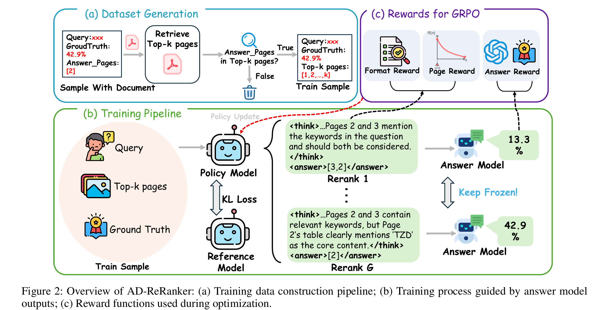
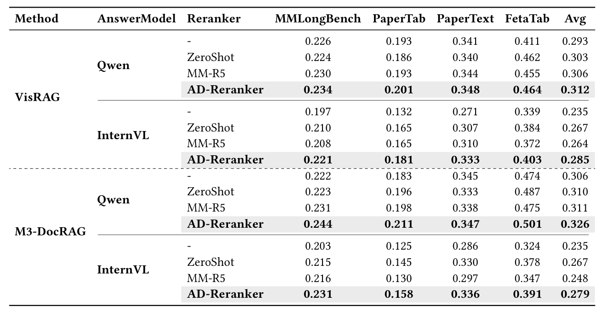

<h2 align="center"><a href="https://arxiv.org/abs/2311.10122">Good Ranks Follow Good Answers: Unsupervised Answer-Driven Reranking for Multimodal Document QA</a></h2>
<h5 align="center">📅 Released on <strong>2025.08.01</strong> &nbsp;&nbsp;&nbsp; ⭐ Star us on GitHub for updates!</h5>

---

## 📚 Contents

- [📝 Project Log](#1)
- [⚡ Highlights](#2)
- [🖼️ Overview](#3)
- [📈 Performance](#4)
- [🚀 QuickStart](#5)
- [⚙️ Requirements](#6)
- [📁 Data Preparation](#7)
- [🧩 Data Extraction](#8)
- [🔍 Retrieval](#9)
- [🎯 Training](#10)
- [🧪 Evaluation](#11)

---
<h2 id="1">📝 Project Log</h2>

+ **[2025.08.01]** 📤 Initial codebase uploaded! 


---
<h2 id="2">⚡ Highlights</h2>
- **Un-supervised Answer-Driven Training:**  
  AD-Reranker uses the quality of generated answers as the training signal, eliminating the need for manual or LLM-generated ranking labels.

- **Reinforcement Learning Optimization:**  
  We formulate reranker training as a reinforcement learning problem, leveraging Group Relative Policy Optimization (GRPO) for stable and effective learning.

- **Multi-Reward Design:**  
  Incorporates format consistency reward, page-level filtering reward, and answer quality reward to improve ranking robustness and QA accuracy.


---
<h2 id="3">🖼️ Overview</h2>
<p align="center">
  
</p>

---
<h2 id="4">📈 Performance</h2>
<p align="center">
  
</p>

---
<h2 id="5">🚀 QuickStart</h2>
We provide LoRA checkpoints in the `ckpt/` directory. To use them, update `config/models/answer.yaml` as follows:

```yaml
model_id: lora_path
```

Then run the following test script ```python scripts/quick_start.py```:

```python
model = MyModel(config)
result = model.quick_start(
    query="Which document contains the student's attendance details?",
    image_paths=["img1.png", "img2.png", "img3.png", "img4.png"]
)
```
<h2 id="6">⚙️ Requirements</h2>
```bash
conda create --name ad-reranker python=3.12
conda activate ad-reranker
pip install -r requirements.txt 

# or run the install script (not all packages included)
bash install.sh
```
<h2 id="7">📁 Data Preparation</h2>
+ **1.Create a data directory:**

```
mkdir data
cd data
```

+ **2.Download the [MP-DocVQA](https://rrc.cvc.uab.es/?ch=17) dataset.**

+ **3.Download additional benchmarks from [HuggingFace](https://huggingface.co/datasets) (temporarily, partically available in our GitHub repo)**
<h2 id="8">🧩 Data Extraction</h2>
```bash
python scripts/extract.py --config-name <dataset>  # mpdoc-vqa/mmlb/ldu/ptab/ptext/feta
```

 ⚠️ The MP-DOCVQA dataset already contains pre-segmented images, so separate image segmentation is not required.

Extracted images will be saved to: ```tmp/<dataset>```
<h2 id="9">🔍 Retrieval</h2>

+ **Colpali**:

```python
python scripts/retrieve.py --config-name <dataset>
```

+ **VisRAG**

```python
cd VisRAG/scripts/visrag_pipeline
python build_index.py
```

Results will be saved at: ```data/<dataset>/sample-with-retrieval-results.json``` and ```data/<dataset>/sample_visrag.json```.
<h2 id="10">🎯 Training</h2>

+ 1.Set your OpenAI API key and select a model in `config/models/base.yaml`:

```yaml
eval_model_name: gpt-4o
train_model_name: gpt-4o
api_key: sk-xxxxxxxxxxxxxxxxxxxxxxxxxxxxxxxxxxxxxxxxx
```

+ 2.Start training:

```python
CUDA_VISIBLE_DEVICES=0,1 python scripts/grpo_train.py --config-name mpdoc
```
<h2 id="11">🧪 Evaluation</h2>

+ M3DocRAG

```bash
# Basic M3DocRAG
python scripts/m3docrag_predict.py --config-name mmlb/ldu/ptab/ptext/feta --run-name=<run-name>

# M3DocRAG + MM-R5
python scripts/m3docrag_predict.py --config-name mmlb/ldu/ptab/ptext/feta --run-name=<run-name>

# M3DocRAG + AD-Reranker
python scripts/predict.py --config-name mmlb/ldu/ptab/ptext/feta --run-name=<run-name>
```

+ VisRAG

Modify the following path in `config/dataset/base.yaml`:

```yaml
# sample_with_retrieval_path: ${dataset.data_dir}/sample-with-retrieval-results.json
sample_with_retrieval_path: ${dataset.data_dir}/sample_visrag.json
```

Evaluation results will be stored in:```results/<dataset>/<run-name>/results.txt```.
